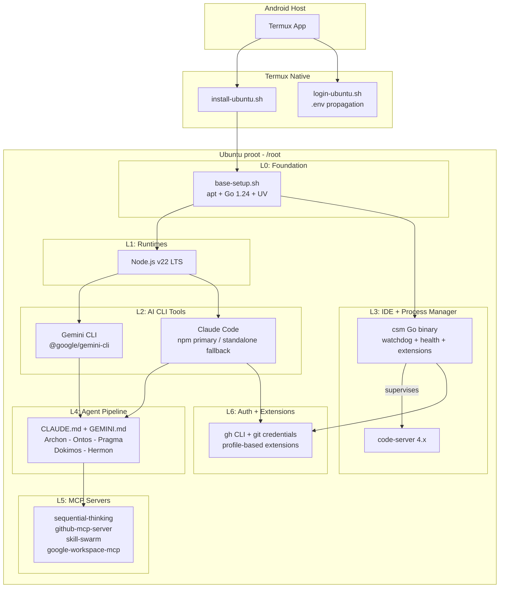
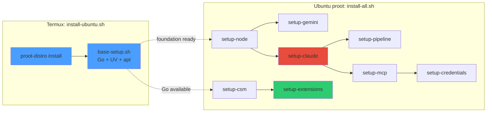
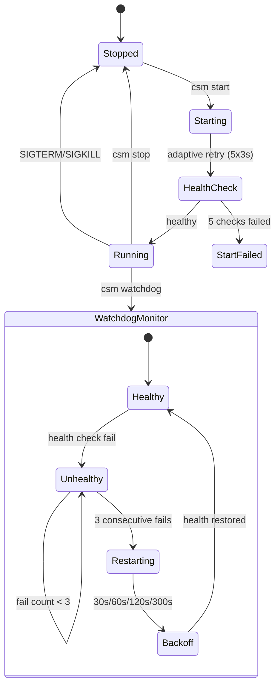
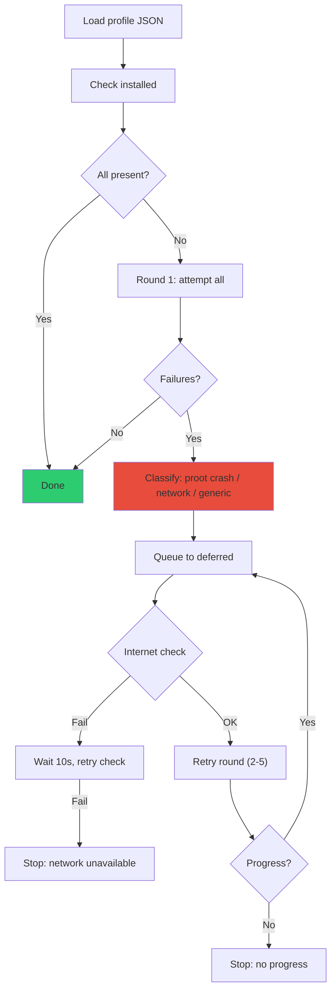
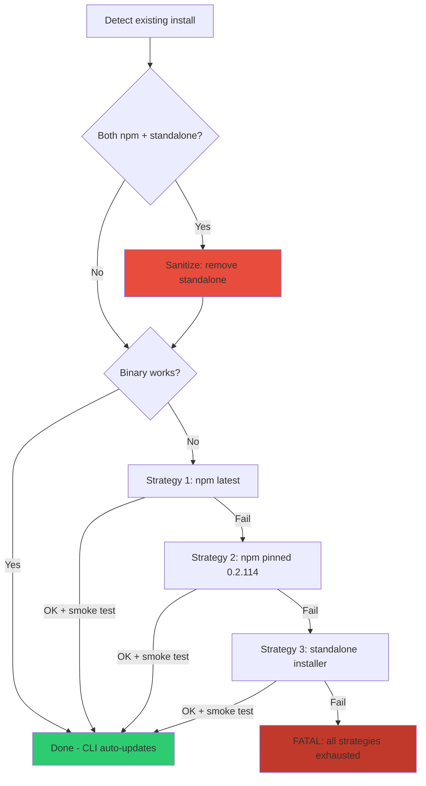
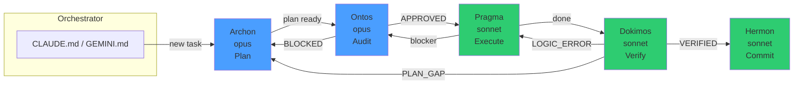

# termux-linux-deployer

Automated deployment of a full development environment inside proot-distro Ubuntu on Termux (Android/arm64). Deploys **Claude Code**, **Gemini CLI**, **code-server**, **Go**, **UV/Python**, **Node.js**, MCP servers, and a 5-agent pipeline framework.

## Target Device

Samsung Galaxy Tab S10 Ultra — 12GB RAM, 256GB storage, Android (locked bootloader).

## Architecture



## Pipeline Flow



`base-setup.sh` runs inside `install-ubuntu.sh` (Termux side) as part of Ubuntu provisioning. `install-all.sh` assumes the foundation layer is already present.

## Quick Start

### 1. Clone and configure

```bash
# In Termux
pkg install git -y
git clone https://github.com/ancrz/termux-linux-deployer.git
cd termux-linux-deployer
cp .env.example .env
nano .env   # Fill: GITHUB_PERSONAL_ACCESS_TOKEN, CS_PASSWORD, GIT_USER_NAME, GIT_USER_EMAIL
```

### 2. Bootstrap Ubuntu

```bash
bash scripts/termux/install-ubuntu.sh
```

### 3. Enter proot and run full setup

```bash
bash scripts/termux/login-ubuntu.sh

# Inside proot Ubuntu — single command installs everything:
bash /root/deployer/scripts/install-all.sh
```

### 4. Start code-server

```bash
csm start                   # start code-server
csm status                  # verify it's running and healthy
# Access via browser at http://localhost:8443
```

### Daily Usage

```bash
# Start
csm start

# Stop
csm stop

# Restart
csm restart

# Start with auto-restart supervisor (keeps code-server alive)
csm watchdog

# Check state
csm status

# View logs
csm logs
```

## Code-Server Manager (csm)

Static Go binary (stdlib only, `CGO_ENABLED=0`) replacing the legacy bash management script.



### Commands

```bash
csm install                        # Install code-server
csm config                         # Generate config.yaml from .env
csm start                          # Start with adaptive health check
csm stop                           # Graceful SIGTERM -> SIGKILL after 5s
csm restart                        # Stop + start
csm status                         # Process state + health
csm health                         # HTTP /healthz check (exit 0/1)
csm logs [N]                       # Last N log lines (default 50)
csm logs rotate                    # Rotate logs if over 100MB (keeps 7 backups)
csm watchdog                       # Supervisor loop with persistent log
csm purge                          # Remove all data (interactive)
csm extensions install [profile]   # Profile-based install with retry
csm extensions list                # List installed extensions
csm extensions sync [profile]      # Sync: install missing, report extras
```

### Log Rotation

Logs auto-rotate on `csm start` and `csm watchdog`. Manual rotation via `csm logs rotate`.

| Setting | Value |
|---------|-------|
| Max file size | 100 MB |
| Max backups | 7 |
| Scheme | `.log` → `.log.1` → `.log.2` → ... → `.log.7` |
| Managed files | `code-server.log`, `watchdog.log` |

## Extension Install Pipeline



Error classification:
- **proot crash**: `double free`, `malloc`, `segfault`, signal 134/139
- **network**: `ECONNREFUSED`, `ETIMEDOUT`, `fetch failed`
- **generic**: unknown error

## Claude Code Installation



## Pipeline Agents (Topos Integrity Protocol)



Agents deployed to `~/.claude/agents/` and `~/.gemini/` by `setup-pipeline.sh`.

## MCP Servers

| Server | Binary | Transport | Token |
|--------|--------|-----------|-------|
| sequential-thinking | npx (on-demand) | stdio | None |
| github-mcp-server | Go arm64 binary | stdio | `GITHUB_PERSONAL_ACCESS_TOKEN` |
| skill-swarm | Python venv | stdio | `GITHUB_PERSONAL_ACCESS_TOKEN` |
| google-workspace-mcp | npx (on-demand) | stdio | OAuth (one-time) |

Registered in both `~/.claude/settings.json` and `~/.gemini/settings.json` with token substitution via `envsubst`.

## Project Structure

```
termux-linux-deployer/
├── scripts/
│   ├── termux/
│   │   ├── install-ubuntu.sh          proot-distro bootstrap
│   │   └── login-ubuntu.sh            env-aware proot login
│   ├── ubuntu/
│   │   ├── lib/common.sh              shared: colors, logging, validators
│   │   ├── base-setup.sh              system packages + Go + UV
│   │   ├── setup-node.sh              Node.js v22 LTS
│   │   ├── setup-gemini.sh            Gemini CLI
│   │   ├── setup-claude.sh            Claude Code (sanitized install)
│   │   ├── setup-csm.sh              Go binary + code-server
│   │   ├── setup-pipeline.sh          agents + settings merge
│   │   ├── setup-mcp.sh              MCP servers
│   │   ├── setup-credentials.sh       git + gh auth
│   ��   └── setup-extensions.sh        profile-based extensions
│   └── install-all.sh                 orchestrator
├── cmd/csm/                           Go source (code-server manager)
├── config/
│   ├── claude/                        settings.json + CLAUDE.md + agents/
│   ├── gemini/                        settings.json + GEMINI.md + agents
│   └── csm/                          profile-extensions.json
├── docs/
│   ├── pipeline-management.md         full operational reference
│   ├── rust-proot-known-issue.md      Rust segfault documentation
│   └── *.sh                           original reference scripts
├── .env.example                       environment template
└── README.md
```

## Resilience Features

| Feature | Mechanism |
|---------|-----------|
| Rust segfault | Graceful skip + documentation |
| Extension malloc crash | Deferred retry loop (5 rounds, error classification) |
| npm/standalone conflict | Auto-detect + sanitize conflicting artifacts |
| code-server slow start | Adaptive health check (5 retries x 3s) |
| Settings overwrite | jq merge (preserves user MCPs) |
| CLI auto-updates | Respected; only reinstall if broken |
| Watchdog restarts | Persistent log + exponential backoff |
| Network failures | Internet pre-check before retry rounds |

## Environment Variables

See `.env.example` for the full list. Key variables:

| Variable | Used by | Required |
|----------|---------|----------|
| `GITHUB_PERSONAL_ACCESS_TOKEN` | gh, github-mcp, skill-swarm | Yes |
| `GITHUB_USERNAME` | git credential store | Yes |
| `CS_PASSWORD` | csm config | Yes |
| `GIT_USER_NAME` / `GIT_USER_EMAIL` | git config | Recommended |
| `GOOGLE_CLIENT_ID` / `GOOGLE_CLIENT_SECRET` | google-workspace-mcp | For Google APIs |

## Idempotency

All scripts are idempotent. Re-running:
- Skips installed/current packages
- Upgrades if newer version available
- Preserves existing configuration (merge, not overwrite)
- Extension install only processes missing extensions

## License

MIT
