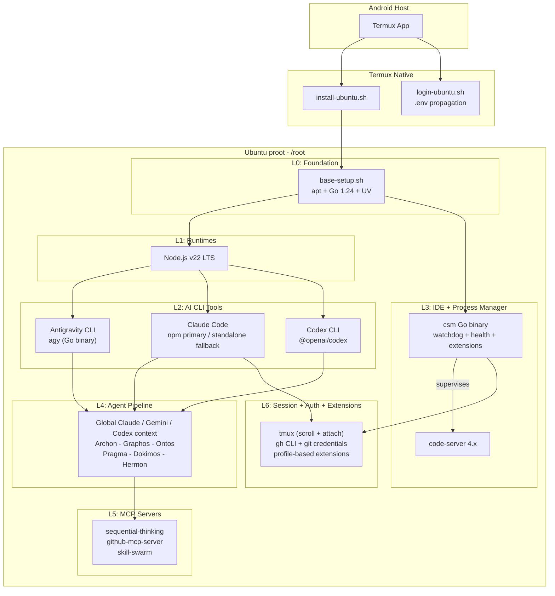
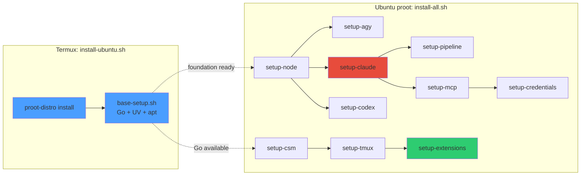
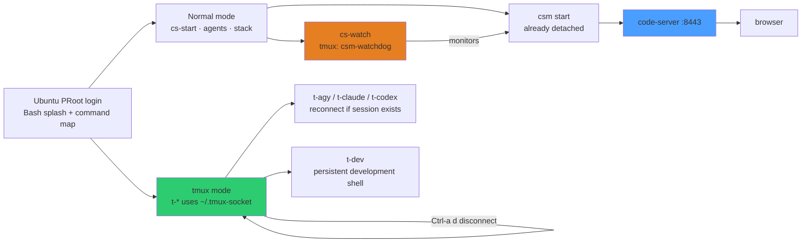
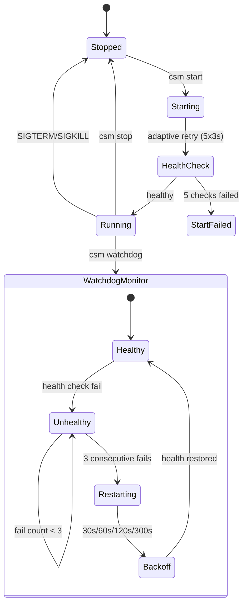
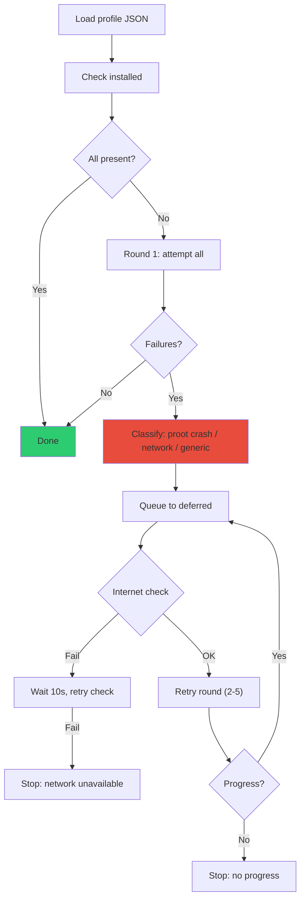
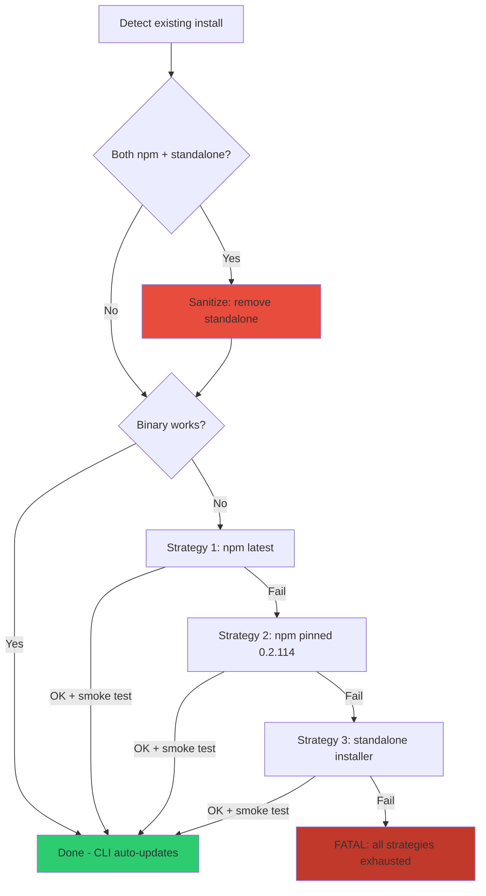
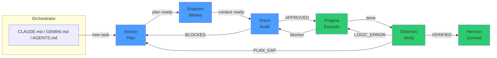

# termux-linux-deployer

[](#interactive-bash-profile)
[](#architecture)
[](#architecture)
[](#tmux-persistence)
[](#code-server-manager-csm)
[](#interactive-bash-profile)

Automated deployment of a full development environment inside proot-distro Ubuntu on Termux (Android/arm64). Deploys **Claude Code**, **Antigravity CLI (agy)**, **Codex CLI**, **code-server**, **Go**, **UV/Python**, **Node.js**, MCP servers, and a 5-agent pipeline framework.

## Target Device

This project scales to hardware where a Linux server and code environments can run smoothly (e.g., high-end or mid-range Android tablets and phones). While initially modeled around premium specs, it is generic enough to work on any modern device with a capable multi-core processor and sufficient RAM (typically 8GB+ recommended for full IDE and agentic workloads).

### Termux Installation

**Important:** The version of Termux available on the Google Play Store is **deprecated** and severely limited by current Android policies. It is highly recommended to download and install Termux directly from **[F-Droid](https://f-droid.org/packages/com.termux/)** or the **[GitHub releases page](https://github.com/termux/termux-app/releases)** to ensure proper functionality and receive updates.

## Architecture



## Pipeline Flow



`base-setup.sh` runs inside `install-ubuntu.sh` (Termux side) as part of Ubuntu provisioning. `install-all.sh` assumes the foundation layer is already present.

## Quick Start

### 1. Clone and configure

**Prerequisites:** You must have Git installed, and both repositories (`termux-linux-deployer` and `pipeline-agentic`) must be cloned into the same parent directory so the installer can discover the agentic rules.

```bash
# In Termux
pkg update && pkg install git -y

# Create a workspace directory
mkdir -p ~/Documents/workspaces
cd ~/Documents/workspaces

# Clone both required repositories (pipeline-agentic must be public or you must be authenticated)
git clone https://github.com/ancrz/termux-linux-deployer.git
git clone https://github.com/ancrz/pipeline-agentic.git

# Configure the deployer
cd termux-linux-deployer
cp .env.example .env
nano .env   # Fill: GITHUB_PERSONAL_ACCESS_TOKEN, CS_PASSWORD, GIT_USER_NAME, GIT_USER_EMAIL
```

### 2. Bootstrap Ubuntu

```bash
bash scripts/termux/install-ubuntu.sh
```

### 3. Enter proot and run full setup

```bash
bash scripts/termux/login-ubuntu.sh

# Inside proot Ubuntu — single command installs everything:
bash /root/deployer/scripts/install-all.sh
```

### PRoot notes

`setup-agy.sh` detects PRoot and installs Antigravity CLI (`agy`) with Google's
official PRoot-compatible installer. It persists `/root/.local/bin` in
`~/.bashrc` and `~/.profile`, so `agy` is available automatically in new shells.
If the shell was already open while the installer ran, reload it once:

```bash
source ~/.bashrc
```

### 4. Start code-server

```bash
# csm already detaches code-server from the current shell.
csm start

# Keep the long-running supervisor in tmux.
csm watchdog --tmux

# Access via browser
# http://localhost:8443
```

### Daily Usage

```bash
# --- code-server ---
cs-start                     # starts the already-detached code-server and prints its URL
cs-stop                      # stop (works regardless of tmux)
cs-restart                   # stop + start
cs-watch                     # persistent watchdog in tmux
cs-attach                    # reconnect to csm-watchdog
cs-status                    # process state + health

# --- tmux session management ---
t-list                       # list sessions using the PRoot-safe socket
t-dev                        # create/reconnect a general development shell
t-agy                        # create/reconnect the agy session
t-claude                     # create/reconnect the Claude Code session
t-codex                      # create/reconnect the Codex session
t-attach csm-watchdog        # attach a named session
# Ctrl-a + d                                      # detach
# Ctrl-a + [                                      # scroll mode
```

> **Note:** PRoot requires a custom socket path (`~/.tmux-socket`), which all `t-*` commands use automatically. `csm start` is already detached; `cs-watch` is the persistent tmux workflow for the watchdog.

### Interactive Bash profile

`setup-shell.sh` installs a native Bash profile with a green/cyan boot splash,
no zsh dependency, and two complementary modes. On every new Ubuntu PRoot
login, the splash keeps the essential commands visible: persistent agent
sessions (`t-agy`, `t-claude`, `t-codex`), `t-dev`, code-server controls, and
the reconnect flow (`t-list`, `t-attach <session>`). Run `source ~/.bashrc`
once in an already-open shell, then use `stack` (or `menu`) for the launcher.
The profile never starts tmux, code-server, or an agent by itself.

**Preflight:** `base-setup.sh` installs `tmux` and the stable Ubuntu
`shellcheck` package; `setup-tmux.sh` validates its configuration; and
`setup-csm.sh`, `setup-agy.sh`, `setup-claude.sh`, and
`setup-codex.sh` provide the optional commands. Each shortcut checks its binary
and gives a clear message if its component was not installed.

| Command | Action |
|---------|--------|
| `ws` / `projects` | Go to `Documents` / `Documents/workspaces` |
| `stack` / `menu` | Open the interactive development menu |
| `stack-help` | Show normal, tmux, and persistence shortcuts |
| `agents` | Choose a pipeline role and engine interactively |
| `archon`, `ontos`, `pragma`, `dokimos`, `hermon` | Start that role with Claude Code |
| `agy-archon`, `agy-ontos`, `agy-pragma`, `agy-dokimos`, `agy-hermon` | Start that role with Antigravity CLI |
| `cs-status`, `cs-start`, `cs-stop`, `cs-restart`, `cs-url` | Manage code-server from a normal shell |
| `cs-watch` / `cs-attach` | Start or reconnect the persistent watchdog session |
| `t-dev`, `t-agy`, `t-claude`, `t-codex` | Create or reconnect persistent developer/agent sessions |
| `t-list`, `t-attach <session>` | Inspect or reconnect any managed tmux session |

### tmux persistence



## Code-Server Manager (csm)

Static Go binary (stdlib only, `CGO_ENABLED=0`) replacing the legacy bash management script.



### Commands

```bash
csm install                        # Install code-server
csm config                         # Generate config.yaml from .env
csm start                          # Start (already detached; tmux is not required)
csm stop                           # Graceful SIGTERM -> SIGKILL after 5s
csm restart                        # Stop + start (already detached)
csm status                         # Process state + health
csm health                         # HTTP /healthz check (exit 0/1)
csm logs [N]                       # Last N log lines (default 50)
csm logs rotate                    # Rotate logs if over 100MB (keeps 7 backups)
csm watchdog --tmux                # Supervisor in detached csm-watchdog tmux session
csm purge                          # Remove all data (interactive)
csm extensions install [profile]   # Profile-based install with retry
csm extensions list                # List installed extensions
csm extensions sync [profile]      # Sync: install missing, report extras
```

### Log Rotation

Logs auto-rotate on `csm start` and `csm watchdog`. Manual rotation via `csm logs rotate`.

| Setting | Value |
|---------|-------|
| Max file size | 100 MB |
| Max backups | 7 |
| Scheme | `.log` → `.log.1` → `.log.2` → ... → `.log.7` |
| Managed files | `code-server.log`, `watchdog.log` |

## Extension Install Pipeline



Error classification:
- **proot crash**: `double free`, `malloc`, `segfault`, signal 134/139
- **network**: `ECONNREFUSED`, `ETIMEDOUT`, `fetch failed`
- **generic**: unknown error

### Installing and syncing extensions

The extension pipeline can run while code-server is active; it does not stop the
server. Install the configured profile after `setup-csm.sh` has completed:

```bash
cd ~/Documents/workspaces/termux-linux-deployer
bash scripts/ubuntu/setup-extensions.sh
```

The operation is idempotent: it skips extensions that are already installed and
retries only deferred failures. To reconcile an existing installation with the
profile later, run:

```bash
csm extensions sync config/csm/profile-extensions.json
```

Reload the code-server browser tab after installation. If an extension still
does not activate, restart the service with `csm restart` and reload the tab.

## Claude Code Installation



## Pipeline Agents (Topos Integrity Protocol)



`pipeline-agentic`, a sibling canonical repository, is copied into a fresh
Ubuntu rootfs and then injected globally after `agy`, Claude, and Codex are
installed. No project-local agent configuration is created.

| CLI | Global pipeline location |
|-----|--------------------------|
| Claude Code | `~/.claude/CLAUDE.md`, `~/.claude/agents/*.md` |
| Antigravity CLI (`agy`) | `~/.gemini/GEMINI.md`, `~/.gemini/config/agents/<role>/agent.md` |
| Codex | `~/.codex/AGENTS.md`, `~/.codex/agentic-pipeline/roles/*.md` |

The installer requires `pipeline-agentic` beside this repository (or a valid
`PIPELINE_SOURCE_DIR`) and fails explicitly instead of falling back to stale
prompt copies. Antigravity workflow templates are maintained in the canonical
repository and added through its Customizations UI; its current documentation
does not define a stable filesystem discovery path.

## MCP Servers

| Server | Binary | Transport | Token |
|--------|--------|-----------|-------|
| sequential-thinking | npx (on-demand) | stdio | None |
| github-mcp-server | Go arm64 binary | stdio | `GITHUB_PERSONAL_ACCESS_TOKEN` |
| skill-swarm | Python venv | stdio | `GITHUB_PERSONAL_ACCESS_TOKEN` |

`setup-mcp.sh` installs Skill Swarm once in
`~/.local/share/skill-swarm/.venv` and registers that absolute interpreter
globally with Claude Code (user scope), agy, and Codex. It also installs the
controller skill canonically in `~/.agents/skills/skill-swarm` and reconciles
links for Claude and both supported agy skill directories. Re-running the setup
is idempotent; existing managed skills are preserved and missing links repaired.
Optional secrets are read at process startup through
`SKILL_SWARM_ENV_FILE` (default: `~/.env`).

## Project Structure

```
termux-linux-deployer/
├── scripts/
│   ├── termux/
│   │   ├── install-ubuntu.sh          proot-distro bootstrap
│   │   └── login-ubuntu.sh            env-aware proot login
│   ├── ubuntu/
│   │   ├── lib/common.sh              shared: colors, logging, validators
│   │   ├── base-setup.sh              system packages + Go + UV
│   │   ├── setup-node.sh              Node.js v22 LTS
│   │   ├── setup-agy.sh               Antigravity CLI (agy)
│   │   ├── setup-claude.sh            Claude Code (sanitized install)
│   │   ├── setup-codex.sh             Codex CLI
│   │   ├── setup-csm.sh              Go binary + code-server
│   │   ├── setup-pipeline.sh          agents + settings merge
│   │   ├── setup-mcp.sh              MCP servers
│   │   ├── setup-tmux.sh              tmux config (scroll + attach)
│   │   ├── setup-shell.sh             native Bash menu + aliases
│   │   ├── setup-credentials.sh       git + gh auth
│   ��   └── setup-extensions.sh        profile-based extensions
│   └── install-all.sh                 orchestrator
├── cmd/csm/                           Go source (code-server manager)
├── config/
│   ├── claude/                        Claude runtime settings
│   ├── agy/                           agy runtime settings and MCP template
│   ├── csm/                          profile-extensions.json
│   ├── shell/                         native Bash banner + menu + aliases
│   └── tmux/                          tmux.conf
├── .env.example                       environment template
└── README.md
```

## Resilience Features

| Feature | Mechanism |
|---------|-----------|
| Rust segfault | Graceful skip with a troubleshooting note |
| Extension malloc crash | Deferred retry loop (5 rounds, error classification) |
| npm/standalone conflict | Auto-detect + sanitize conflicting artifacts |
| code-server slow start | Adaptive health check (5 retries x 3s) |
| Settings overwrite | jq merge (preserves user MCPs) |
| CLI auto-updates | Respected; only reinstall if broken |
| Watchdog restarts | Persistent log + exponential backoff |
| Network failures | Internet pre-check before retry rounds |

## Environment Variables

See `.env.example` for the full list. Key variables:

| Variable | Used by | Required |
|----------|---------|----------|
| `GITHUB_PERSONAL_ACCESS_TOKEN` | gh, github-mcp, skill-swarm | Yes |
| `GITHUB_USERNAME` | git credential store | Yes |
| `CS_PASSWORD` | csm config | Yes |
| `GIT_USER_NAME` / `GIT_USER_EMAIL` | git config | Recommended |

## Idempotency

All scripts are idempotent. Re-running:
- Skips installed/current packages
- Upgrades if newer version available
- Preserves existing configuration (merge, not overwrite)
- Extension install only processes missing extensions

## License

This project is released under the [MIT License](LICENSE). You may use, copy,
modify, distribute, sublicense, and improve it, provided that the copyright
and license notice are retained. It is provided without warranty.
