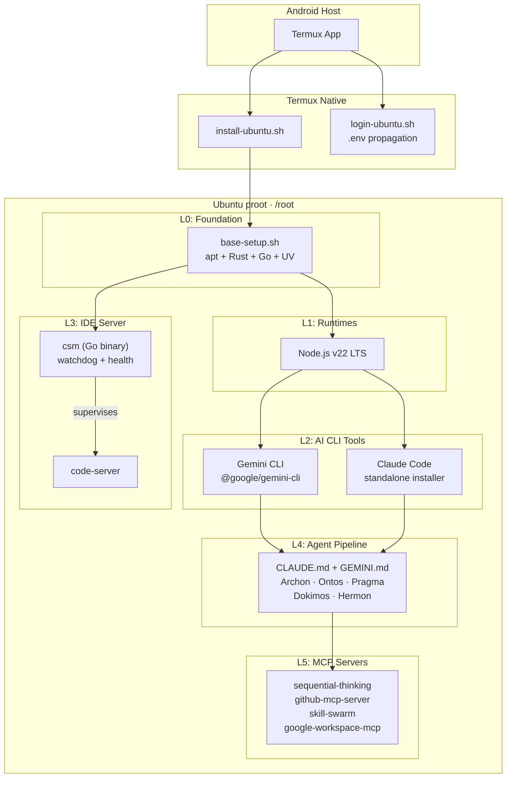

# termux-linux-deployer

Automated deployment of a full development environment inside proot-distro Ubuntu on Termux (Android/arm64).

Deploys: **Claude Code**, **Gemini CLI**, **code-server**, **UV/Python**, **Node.js**, **Rust**, **Go**, and the pipeline-agentic agent framework.

## Target Device

Samsung Galaxy Tab S10 Ultra — 12GB RAM, 256GB storage, Android (locked bootloader).

## Architecture



## Quick Start

### 1. Clone and configure

```bash
# In Termux
pkg install git -y
git clone https://github.com/ancrz/termux-linux-deployer.git
cd termux-linux-deployer

# Configure environment
cp .env.example .env
nano .env   # Fill in your tokens and passwords
```

### 2. Bootstrap Ubuntu

```bash
bash scripts/termux/install-ubuntu.sh
```

This installs proot-distro Ubuntu, copies deployer scripts into the rootfs, and runs `base-setup.sh` (system packages + Rust + Go + UV).

### 3. Enter proot and complete setup

```bash
bash scripts/termux/login-ubuntu.sh

# Inside proot Ubuntu:
bash /root/deployer/scripts/install-all.sh
```

This installs (in order): Node.js, Gemini CLI, Claude Code, code-server manager (csm), pipeline agent configs, and MCP servers.

### 4. Start code-server

```bash
csm start
```

Access via browser at `http://localhost:8443`.

## Project Structure

```
termux-linux-deployer/
├── scripts/
│   ├── termux/
│   │   ├── install-ubuntu.sh     # proot-distro bootstrap
│   │   └── login-ubuntu.sh      # env-aware proot login wrapper
│   ├── ubuntu/
│   │   ├── lib/common.sh        # shared functions (colors, logging, validators)
│   │   ├── base-setup.sh        # system packages + Rust + Go + UV
│   │   ├── setup-node.sh        # Node.js v22 LTS
│   │   ├── setup-gemini.sh      # Gemini CLI
│   │   ├── setup-claude.sh      # Claude Code (multi-fallback installer)
│   │   ├── setup-csm.sh         # builds csm Go binary + installs code-server
│   │   ├── setup-pipeline.sh    # deploys agent configs (Claude + Gemini)
│   │   └── setup-mcp.sh         # GitHub MCP, skill-swarm, google-workspace
│   └── install-all.sh           # orchestrator (runs all ubuntu scripts)
├── cmd/csm/                     # Go source for code-server manager
├── config/
│   ├── claude/                  # Claude Code settings + pipeline agents
│   ├── gemini/                  # Gemini CLI settings + pipeline agents
│   └── csm/                    # code-server config template
├── .env.example                 # environment variable template
└── README.md
```

## Code-Server Manager (csm)

Go binary replacing the shell-based code-server management. Features:

- Process supervision with PID file locking
- HTTP health checks (`/healthz`)
- Watchdog mode: auto-restart on failure with exponential backoff
- Config generation from environment variables

```bash
csm install     # Install code-server
csm config      # Generate config from .env
csm start       # Start in background
csm stop        # Graceful stop (SIGTERM -> SIGKILL)
csm restart     # Stop + start
csm status      # Process state + health
csm health      # HTTP health check
csm logs        # Tail log file
csm watchdog    # Background supervisor loop
csm purge       # Remove all data (interactive)
```

## Claude Code Installation

Claude Code uses a multi-fallback installation strategy for aarch64/proot:

1. **Standalone installer** (recommended): `curl -fsSL https://claude.ai/install.sh | bash`
2. **npm** (deprecated fallback): `npm install -g @anthropic-ai/claude-code`
3. **npm pinned** (last resort): `@anthropic-ai/claude-code@0.2.114`

Each step includes a smoke test (`timeout 15 claude --version`) to verify the installation works on the platform.

## MCP Servers

| Server | Transport | Notes |
|--------|-----------|-------|
| sequential-thinking | npx | Works out of the box |
| github-mcp-server | Go binary (arm64) | Downloaded from official releases |
| skill-swarm | Python venv | Cloned and installed locally |
| google-workspace-mcp | npx | Requires one-time OAuth setup (see below) |

### Google Workspace OAuth Setup

After installation, complete the one-time OAuth flow:

```bash
npx google-workspace-mcp auth
```

This opens a browser URL. On the tablet, copy the URL to Android's browser, authenticate, and the token is saved automatically.

## Pipeline Agents

Both Claude Code and Gemini CLI are configured with the pipeline-agentic framework:

- **Archon** — Planning (opus)
- **Ontos** — Structural audit (opus)
- **Pragma** — Code execution (sonnet)
- **Dokimos** — Verification (sonnet)
- **Hermon** — Git operations (sonnet)

Agent definitions are deployed to `~/.claude/agents/` and `~/.gemini/` by `setup-pipeline.sh`.

## Idempotency

All scripts are idempotent. Running them again will:
- Skip already-installed and current packages
- Upgrade to latest if a newer version is available
- Preserve existing configuration

## Environment Variables

See `.env.example` for the full list. Key variables:

| Variable | Used by | Required |
|----------|---------|----------|
| `GITHUB_PERSONAL_ACCESS_TOKEN` | github-mcp, skill-swarm | Yes |
| `CS_PASSWORD` | code-server (csm) | Yes |
| `GIT_USER_NAME` / `GIT_USER_EMAIL` | git config | Recommended |
| `GOOGLE_CLIENT_ID` / `GOOGLE_CLIENT_SECRET` | google-workspace-mcp | For Google APIs |

## License

MIT
